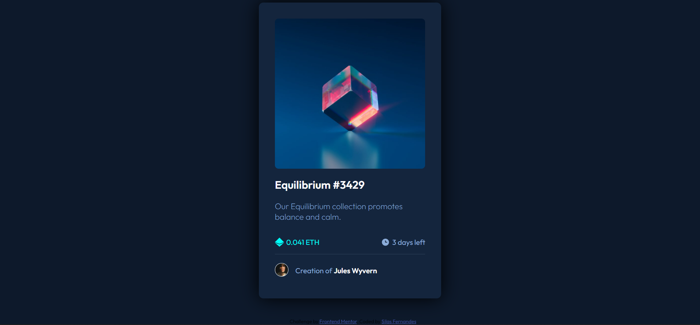
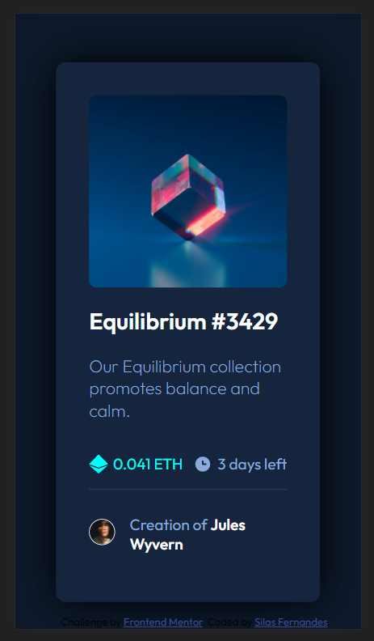

# Frontend Mentor - NFT preview card component solution

This is a solution to the [NFT preview card component challenge on Frontend Mentor](https://www.frontendmentor.io/challenges/nft-preview-card-component-SbdUL_w0U). Frontend Mentor challenges help you improve your coding skills by building realistic projects.

## Table of contents

- [Overview](#overview)
  - [The challenge](#the-challenge)
  - [Screenshot](#screenshot)
  - [Links](#links)
- [My process](#my-process)
  - [Built with](#built-with)
  - [What I learned](#what-i-learned)
  - [Continued development](#continued-development)
  - [Useful resources](#useful-resources)
- [Author](#author)
- [Acknowledgments](#acknowledgments)

## Overview

### The challenge

Users should be able to:

- View the optimal layout depending on their device's screen size
- See hover states for interactive elements

### Screenshot

### Links

- Solution URL: [Add solution URL here](https://github.com/SilasFr/nft_preview_card_challenge)
- Live Site URL: [Add live site URL here](https://silasfr.github.io/nft_preview_card_challenge/)

## My process

### Built with

- Semantic HTML5 markup
- CSS custom properties
- Flexbox
- Mobile-first workflow

### What I learned

The HTML in this project is very simple. But I did learn how to bend the CSS properties to my will. The 'transition' property is key in this project and it gives a totally different feeling to the user.

Also I learned how to render an image sometimes as background-image or sometimes as an  tag. Dependin on what you want to do with it, it may be easier to have it one way or another.

### Continued development

I plan on getting my CSS skills to a higher level. I see that my peers have a hard time using CSS but it is actually amazing what you can do just with HTML and CSS!

### Useful resources

- [Live-Server] - This helped me work a lot faster, and see changes in real time.
- [MDN Web Docs](https://developer.mozilla.org/en-US/) - This is an amazing website that teaches a lot about web development.

## Author

- Website - [Silas Fernandes](https://github.com/SilasFr)
- Frontend Mentor - [@SilasFr](https://www.frontendmentor.io/profile/SilasFr)
- Twitter - [@SylarFN](https://twitter.com/SylarFN)

## Acknowledgments

I did this project by myself, but with the motivational help of my friend Leonardo Nunes.
